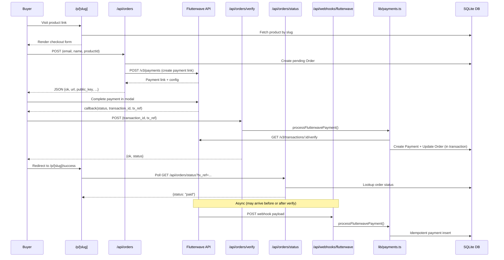

# SellSnap Payment Workflow — Security Audit

**Audit Date:** 2026-05-25  
**Scope:** Every file in the payment chain, from the buyer checkout form to the Flutterwave webhook handler, including all supporting helpers.

---

## Files Audited

| # | File | Role |
|---|------|------|
| 1 | [ProductCheckoutForm.tsx](file:///c:/Users/HP/Desktop/Sellsnap/app/p/%5Bslug%5D/ProductCheckoutForm.tsx) | Client-side checkout form + Flutterwave modal |
| 2 | [page.tsx (product)](file:///c:/Users/HP/Desktop/Sellsnap/app/p/%5Bslug%5D/page.tsx) | Server-rendered product page |
| 3 | [route.ts (orders)](file:///c:/Users/HP/Desktop/Sellsnap/app/api/orders/route.ts) | Order creation + Flutterwave payment link generation |
| 4 | [route.ts (verify)](file:///c:/Users/HP/Desktop/Sellsnap/app/api/orders/verify/route.ts) | Client-triggered payment verification |
| 5 | [route.ts (status)](file:///c:/Users/HP/Desktop/Sellsnap/app/api/orders/status/route.ts) | Order status polling |
| 6 | [route.ts (webhook)](file:///c:/Users/HP/Desktop/Sellsnap/app/api/webhooks/flutterwave/route.ts) | Flutterwave webhook receiver |
| 7 | [payments.ts](file:///c:/Users/HP/Desktop/Sellsnap/lib/payments.ts) | Shared verification + payment processing pipeline |
| 8 | [page.tsx (success)](file:///c:/Users/HP/Desktop/Sellsnap/app/p/%5Bslug%5D/success/page.tsx) | Post-payment success page |
| 9 | [email.ts](file:///c:/Users/HP/Desktop/Sellsnap/lib/email.ts) | Seller notification email |
| 10 | [env.ts](file:///c:/Users/HP/Desktop/Sellsnap/lib/env.ts) | Environment variable validation |
| 11 | [auth.ts](file:///c:/Users/HP/Desktop/Sellsnap/lib/auth.ts) | Session management |
| 12 | [.env](file:///c:/Users/HP/Desktop/Sellsnap/.env) | Environment secrets |

---

## Payment Flow Diagram



---

## Findings

### 🔴 CRITICAL — Severity 1

---

#### C1: Verify endpoint is completely unauthenticated and unprotected
**File:** [route.ts (verify)](file:///c:/Users/HP/Desktop/Sellsnap/app/api/orders/verify/route.ts)  
**Lines:** 4–34

> [!CAUTION]
> Any attacker who knows (or guesses) a `transaction_id` and `tx_ref` can call this endpoint repeatedly. While the Flutterwave verify API acts as a gate, this endpoint has **no rate limiting, no authentication, and no origin check**. An attacker can use it to:
> 1. **Probe for valid transaction references** — enumerate `tx_ref` values to discover orders.
> 2. **Trigger the full verification pipeline on demand** — including the seller notification email, causing email spam.
> 3. **Abuse Flutterwave API rate limits** — each call makes an outbound request to Flutterwave's verify endpoint, potentially exhausting your API quota or getting your key throttled.

**Remediation:** Add rate limiting (IP-based, at minimum 5 req/min). Consider requiring a short-lived HMAC token issued during order creation that must accompany the verify call.

---

#### C2: Order creation endpoint has zero rate limiting — card testing attack vector
**File:** [route.ts (orders)](file:///c:/Users/HP/Desktop/Sellsnap/app/api/orders/route.ts)  
**Lines:** 6–112

> [!CAUTION]
> The `/api/orders` endpoint creates a pending order and calls Flutterwave to generate a payment link **with no rate limiting whatsoever**. This is a textbook **card testing** vector:
> - A fraudster can submit thousands of requests with different buyer emails, generating thousands of Flutterwave payment sessions.
> - Each request creates a database row (storage exhaustion).
> - Each request makes an outbound API call to Flutterwave (quota exhaustion).
> - Flutterwave may flag and suspend your merchant account.

**Remediation:** Implement rate limiting per IP (e.g., 10 orders/minute/IP). This is explicitly called out in your own [security.md](file:///c:/Users/HP/Desktop/Sellsnap/.agent) rules but not implemented.

---

#### C3: No stale order cleanup — unbounded database growth from abandoned orders
**File:** [route.ts (orders)](file:///c:/Users/HP/Desktop/Sellsnap/app/api/orders/route.ts)

Every checkout attempt creates a `pending` Order row. If the buyer abandons payment, the row stays forever. Combined with C2, an attacker can create millions of rows. There is no TTL, no cleanup job, and no expiration field on Orders.

**Remediation:** Add a `expiresAt` column to the Order model. Run a periodic cleanup (cron or on-demand) to delete or archive orders that have been `pending` for more than 1 hour.

---

### 🟠 HIGH — Severity 2

---

#### H1: Order status endpoint leaks buyer PII to anyone with a tx_ref
**File:** [route.ts (status)](file:///c:/Users/HP/Desktop/Sellsnap/app/api/orders/status/route.ts)  
**Lines:** 20–29

> [!WARNING]
> The status endpoint returns `buyerEmail`, `productName`, `amountNaira`, and `paidAt` to **anyone** who provides a valid `tx_ref`. The `tx_ref` format is predictable: `sellsnap_order_{cuid}_{8-hex-chars}`. While CUIDs contain entropy, the endpoint has no authentication and no rate limiting, making it susceptible to enumeration.

```typescript
// Returns PII to any caller — no auth required
return NextResponse.json({
  ok: true,
  data: {
    status: order.status,
    productName: order.product.name,
    amountNaira: order.amountKobo / 100,
    buyerEmail: order.buyerEmail,  // ← PII leak
    paidAt: order.payment?.paidAt || null,
  },
});
```

**Remediation:** Remove `buyerEmail` from the public response, or require a signed token to access the full details. For the success page, `status` and `productName` are sufficient.

---

#### H2: Flutterwave public key is returned in the order creation API response
**File:** [route.ts (orders)](file:///c:/Users/HP/Desktop/Sellsnap/app/api/orders/route.ts)  
**Line:** 95

```typescript
public_key: env.FLUTTERWAVE_PUBLIC_KEY,
```

While the public key is *designed* to be public, returning it in every API response means any automated tool can harvest it. The key should be injected into the client at build time via `NEXT_PUBLIC_FLUTTERWAVE_PUBLIC_KEY` and not be served from an unauthenticated API. More importantly, the current `env.ts` schema loads it from `FLUTTERWAVE_PUBLIC_KEY` (no `NEXT_PUBLIC_` prefix), which means it's treated as a server secret but then immediately returned in a public response — a conceptual inconsistency that could cause confusion during key rotation.

**Remediation:** Move the public key to `NEXT_PUBLIC_FLUTTERWAVE_PUBLIC_KEY` and inject it at build time. Remove it from the API response.

---

#### H3: Signup action leaks internal error messages to the client
**File:** [signup-actions.ts](file:///c:/Users/HP/Desktop/Sellsnap/app/%28marketing%29/auth/signup-actions.ts)  
**Line:** 70

```typescript
return { error: error instanceof Error ? error.message : "Something went wrong during signup" };
```

> [!WARNING]
> If a Prisma error or any other internal exception is thrown, its raw `.message` is returned directly to the client. This can leak database column names, constraint names, or connection details. The same pattern exists in [login-actions.ts:42](file:///c:/Users/HP/Desktop/Sellsnap/app/%28marketing%29/auth/login-actions.ts#L42).

**Remediation:** Always return a generic message. Log the real error server-side.

---

### 🟡 MEDIUM — Severity 3

---

#### M1: Order creation uses no Zod validation on incoming form data
**File:** [route.ts (orders)](file:///c:/Users/HP/Desktop/Sellsnap/app/api/orders/route.ts)  
**Lines:** 7–18

Input validation is done with manual `if` checks and a simple regex for email. Your own `security.md` mandates Zod for all external inputs. The email regex `^[^\s@]+@[^\s@]+\.[^\s@]+$` accepts many invalid addresses (e.g., `a@b.c` with no TLD validation, or strings with special characters that could cause issues in email systems).

```typescript
// Current: hand-rolled checks
const productId = formData.get('productId') as string;
const email = formData.get('email') as string;
if (!/^[^\s@]+@[^\s@]+\.[^\s@]+$/.test(email)) { ... }
```

**Remediation:** Define a Zod schema for the order creation payload and use `.safeParse()`.

---

#### M2: Product image stored as base64 data URI in the database — unbounded row size
**File:** [route.ts (products/create)](file:///c:/Users/HP/Desktop/Sellsnap/app/api/products/create/route.ts)  
**Lines:** 40–44

```typescript
const base64 = buffer.toString("base64");
imageUrl = `data:${imageFile.type};base64,${base64}`;
```

> [!WARNING]
> A 5MB image becomes a ~6.7MB base64 string stored directly in a SQLite TEXT column. This violates your own `security.md` rule ("Do not store uploaded product images on the filesystem. Use the configured storage provider"). Worse:
> - No MIME type validation of actual file bytes (only trusts `imageFile.type` from client).
> - No file size enforcement at the API level.
> - No EXIF metadata stripping.
> - The base64 blob is served verbatim in `` on the product page, inflating HTML size and destroying page load performance — critical for the mobile-first WhatsApp share flow.

**Remediation:** Upload to object storage (S3/R2/etc.) per `security.md`. Validate actual file bytes. Strip EXIF. Enforce 5MB limit server-side.

---

#### M3: Session token not invalidated on password reset
**File:** [reset-password/actions.ts](file:///c:/Users/HP/Desktop/Sellsnap/app/%28marketing%29/auth/reset-password/actions.ts)  
**Lines:** 36–47

After a password reset, the code creates a new session for the user but **does not invalidate existing sessions**. If an attacker has a stolen session cookie, it remains valid even after the victim resets their password. The session system is stateless (HMAC-signed cookie with no server-side record), so there is no mechanism to revoke individual sessions.

**Remediation:** Add a `sessionVersion` or `passwordChangedAt` field to the User model. Check it in `getSession()`. Increment on password change.

---

#### M4: HMAC signature comparison is not timing-safe
**File:** [auth.ts](file:///c:/Users/HP/Desktop/Sellsnap/lib/auth.ts)  
**Line:** 22

```typescript
if (signature === expectedSignature) {
```

String equality comparison is vulnerable to timing attacks. An attacker can statistically determine the correct HMAC byte-by-byte by measuring response times.

**Remediation:** Use `crypto.timingSafeEqual(Buffer.from(signature), Buffer.from(expectedSignature))`.

---

#### M5: Webhook hash comparison is not timing-safe
**File:** [route.ts (webhook)](file:///c:/Users/HP/Desktop/Sellsnap/app/api/webhooks/flutterwave/route.ts)  
**Line:** 15

```typescript
if (!signature || signature !== env.FLUTTERWAVE_SECRET_HASH) {
```

Same issue as M4 but for the webhook secret. An attacker can use timing analysis to brute-force the `FLUTTERWAVE_SECRET_HASH` value, which would allow forging webhook payloads.

**Remediation:** Use `crypto.timingSafeEqual()`.

---

### 🔵 LOW — Severity 4

---

#### L1: Password reset token logged to console in production
**File:** [forgot-password/actions.ts](file:///c:/Users/HP/Desktop/Sellsnap/app/%28marketing%29/auth/forgot-password/actions.ts)  
**Line:** 34

```typescript
console.log('Password reset link:', resetLink);
```

The reset link (which contains the full secret token) is logged to stdout. In production, stdout typically goes to a logging service visible to anyone with infrastructure access. This token grants full password reset capability.

**Remediation:** Remove this log. Send the token only via email.

---

#### L2: Debug `console.log` statements leak user data in signup flow
**File:** [signup-actions.ts](file:///c:/Users/HP/Desktop/Sellsnap/app/%28marketing%29/auth/signup-actions.ts)  
**Lines:** 29, 55, 65, 67

```typescript
console.log("Signup attempt for email:", data.email);  // ← PII in logs
console.log("User created, ID:", user.id);
console.log("Session created for user ID:", user.id);
```

Emails and user IDs are logged. Your `security.md` says: "Never log: passwords, session tokens, full card numbers..." and "Log user ID (not email, not name) when relevant."

**Remediation:** Replace `console.log` with `logger.info` and remove the email from log output.

---

#### L3: No security headers configured
**File:** [next.config.ts](file:///c:/Users/HP/Desktop/Sellsnap/next.config.ts)

The Next.js config exports an empty object. No security headers are set:
- No `Content-Security-Policy`
- No `X-Frame-Options` (clickjacking)
- No `X-Content-Type-Options`
- No `Referrer-Policy`
- No `Strict-Transport-Security`

**Remediation:** Add a `headers()` function in `next.config.ts` to set security headers for all routes.

---

### ⚪ INFORMATIONAL

---

#### I1: `.env` file with real-looking test keys exists in the repository

The `.gitignore` contains `.env*` which should prevent committing, but the file exists in the workspace with what appear to be real Flutterwave test keys. Verify these have not been committed to version control history. If they have, rotate them immediately.

#### I2: `webhook-handler.ts` in project root is dead code

The file at [webhook-handler.ts](file:///c:/Users/HP/Desktop/Sellsnap/webhook-handler.ts) is a reference implementation not used anywhere. It contains an import from `@prisma/client` (`PrismaClientKnownRequestError`) that differs from the actual webhook handler's approach. Dead code with outdated patterns creates confusion and merge risk.

#### I3: Login action unconditionally sets `onboardingComplete: true`
**File:** [login-actions.ts](file:///c:/Users/HP/Desktop/Sellsnap/app/%28marketing%29/auth/login-actions.ts#L36-L39)

```typescript
await db.user.update({
  where: { id: user.id },
  data: { onboardingComplete: true },
});
```

Every login marks onboarding as complete, even if the user never finished it. This is likely a debugging shortcut that should not ship to production.

---

## Summary Table

| ID | Severity | Category | Finding |
|----|----------|----------|---------|
| C1 | 🔴 Critical | Access Control | Verify endpoint unauthenticated, no rate limit |
| C2 | 🔴 Critical | Rate Limiting | Order creation wide open to card testing |
| C3 | 🔴 Critical | Resource Exhaustion | No stale order cleanup |
| H1 | 🟠 High | Data Exposure | Status endpoint leaks buyer email |
| H2 | 🟠 High | Key Management | Public key served from server-only env var |
| H3 | 🟠 High | Error Handling | Raw error messages leaked to client |
| M1 | 🟡 Medium | Input Validation | No Zod validation on order creation |
| M2 | 🟡 Medium | File Handling | Images stored as base64 in DB, no validation |
| M3 | 🟡 Medium | Session Management | Sessions not revoked on password reset |
| M4 | 🟡 Medium | Cryptography | Session HMAC uses timing-unsafe comparison |
| M5 | 🟡 Medium | Cryptography | Webhook hash uses timing-unsafe comparison |
| L1 | 🔵 Low | Logging | Password reset token logged to console |
| L2 | 🔵 Low | Logging | User PII in debug console.log statements |
| L3 | 🔵 Low | Security Headers | No CSP, HSTS, X-Frame-Options configured |

---

## Overall Rating

### 5.5 / 10 — "Functional but not production-ready"

The payment workflow gets the **core verification logic right** — the `processFlutterwavePayment` pipeline is well-structured with proper out-of-band verification, idempotent database writes, and structured logging. That's genuinely good engineering. But the **perimeter around it is wide open**.

| Dimension | Score | Notes |
|-----------|-------|-------|
| **Architecture** | 7/10 | Clean separation of webhook handler → shared processor. Payment logging is excellent. The dual-path verification (webhook + client verify) is correct. |
| **Flutterwave Verification** | 8/10 | Independent server-side verify call, currency/amount checks, correct BigInt conversion. Overpayment is logged as warning, not rejected — reasonable. |
| **Idempotency** | 9/10 | Unique constraint on `gatewayReference`, `P2002` catch, duplicate ignored. This is textbook correct. |
| **Input Validation** | 3/10 | Order creation has no Zod schema. Email validated by weak regex. Product ID not validated as CUID. No file-type byte checking on image uploads. |
| **Secrets & Key Handling** | 4/10 | `.env` gitignored (good), env validation via Zod (good). But public key served from server env, timing-unsafe comparisons on HMAC and webhook hash, reset token logged to console. |
| **Rate Limiting & Access Control** | 1/10 | No rate limiting anywhere. No middleware. No CSRF on route handlers. No origin checking. The `security.md` rules explicitly require rate limiting on order creation, login, signup, and password reset — none of it is implemented. |
| **Session Security** | 5/10 | HMAC-signed, httpOnly, secure in prod, sameSite lax — solid baseline. But no session revocation mechanism, no timing-safe comparison, and password reset doesn't invalidate existing sessions. |
| **Logging & Observability** | 6/10 | PaymentLog table is a great audit trail. But production logger is just `console.*` wrappers. Debug logs leak PII. |

### What's good

- The shared `processFlutterwavePayment` function is a single source of truth for verification — both the webhook and the client-verify endpoint use it. This prevents logic divergence.
- Idempotency handling via unique constraints is correct and robust.
- The PaymentLog audit trail captures every step of the verification pipeline.
- Argon2id for password hashing is the right choice.
- Environment validation at boot catches misconfiguration early.

### What needs immediate attention before production

1. **Rate limiting** on `/api/orders`, `/api/orders/verify`, login, and signup.
2. **Timing-safe comparisons** on the webhook hash and session HMAC.
3. **Remove PII from logs** and the password reset token from console output.
4. **Strip buyer email** from the public status endpoint response.
5. **Migrate image storage** from base64-in-DB to object storage.
